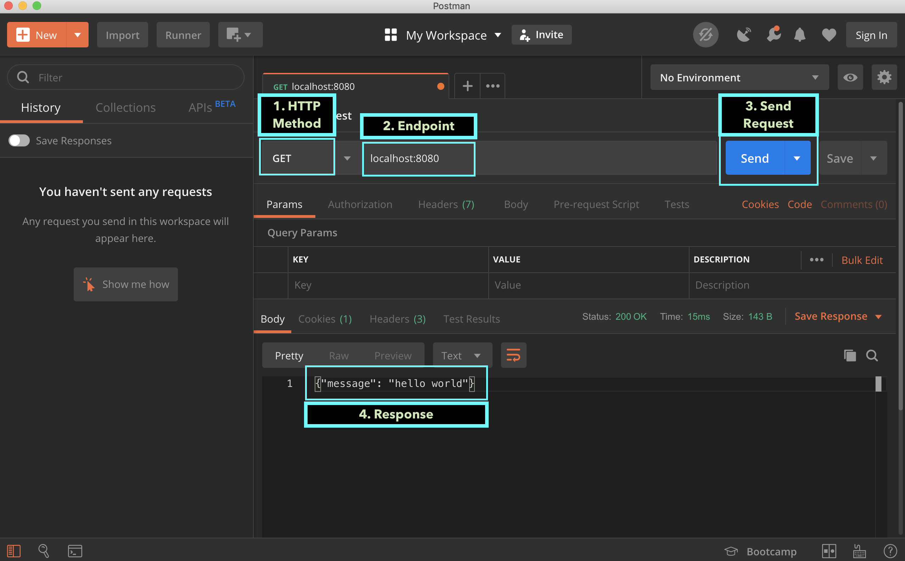
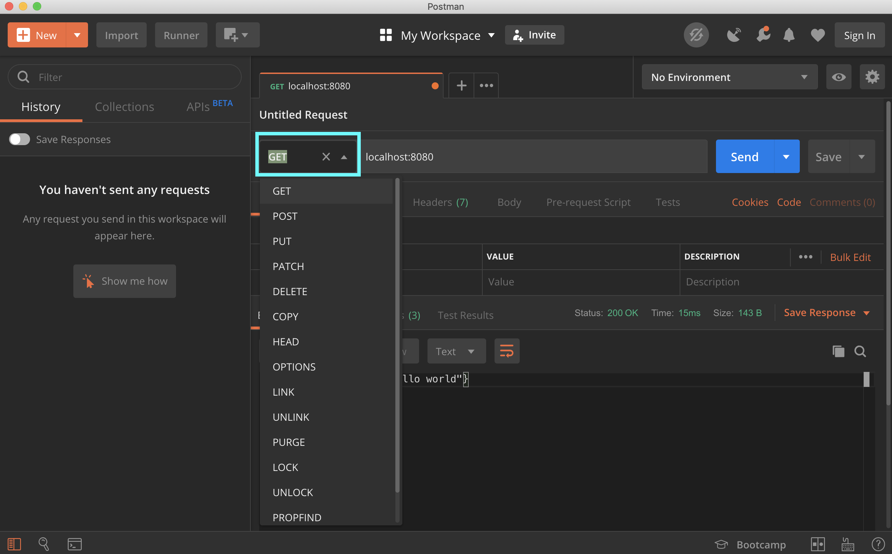

# Simple Rest API

So let's jump right into it.

```text
package main

import (
	"log"
	"net/http"
)

type server struct{}

func (s *server) ServeHTTP(w http.ResponseWriter, r *http.Request) {
	w.WriteHeader(http.StatusOK)
	w.Header().Set("Content-Type", "application/json")
	w.Write([]byte(`{"message": "hello world"}`))
}

func main() {
	s := &server{}
	http.Handle("/", s)
	log.Fatal(http.ListenAndServe(":8080", nil))
}
```

Lets break down this code. 

At the top we have our `package main` all go executable need a main package.

We have our imports. `log` for logging some error if it happens. `net/http` because we are writing a rest api.

Then we have a struct called server. It has no fields. We will add a method to this server `ServeHTTP` and that will satisfy the Handler interface. One thing you will notice in go we don't have to explicitly say the interface we are implementing. The compiler is smart enough to figure that out. In the `ServeHTTP` method we set httpStatus 200 to denote its the request was a success. We se the content type to `application/json` so the client understands when we send back json as payload. Finally we write 

```text
{"message": "hello world"}
```

To the response.

Lets run our server

```text
go run main.go
```

If you had installed postman before, let's test our app with postman real quick.



Get returns us our message. 

Great work! 

But Wait.

Lets see what other HTTP verbs our application serves.

In postman we can change the Type of request we make. Click on the dropdown and select something else. Lets say we do post.



Now if we run the request, we get back the same result. 

Well its not really a bug per se. But in most cases we probably want to do different things based on the request types.

Lets see how we can do that.

We will modify our ServeHTTP method with the following.

```text
func (s *server) ServeHTTP(w http.ResponseWriter, r *http.Request) {
	w.Header().Set("Content-Type", "application/json")
	switch r.Method {
	case "GET":
		w.WriteHeader(http.StatusOK)
		w.Write([]byte(`{"message": "get called"}`))
	case "POST":
		w.WriteHeader(http.StatusCreated)
		w.Write([]byte(`{"message": "post called"}`))
	case "PUT":
		w.WriteHeader(http.StatusAccepted)
		w.Write([]byte(`{"message": "put called"}`))
	case "DELETE":
		w.WriteHeader(http.StatusOK)
		w.Write([]byte(`{"message": "delete called"}`))
	default:
		w.WriteHeader(http.StatusNotFound)
		w.Write([]byte(`{"message": "not found"}`))
	}
}
```

If our server is already running lets stop it with `ctrl-c`

Run it again.

```text
go run main.go
```

Test it with postman or curl again.

